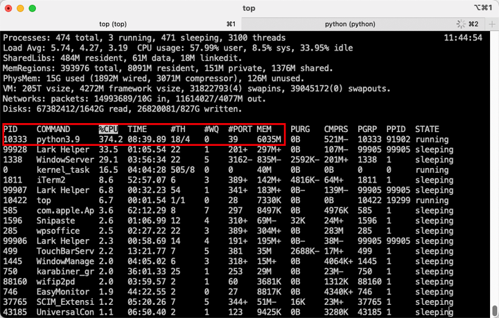

# rwkv.cpp: CPU 也能跑的 RNN 中文语言大模型

最近 LLM（大语言模型）实在火爆，出了不少开源模型，比如 Alpaca[^1]、ChatGLM[^2]、BELLE[^3] 等等，让每个人都有机会运行和训练专属自己的 LLM，我也迫不及待了。

但是，熟悉我的老读者朋友应该知道，虽然我是搞算法的，也发过几篇论文，但我是走的是贫穷科研的路线，一张显卡都没有。像 ChatGLM-6B 这种模型，在我的小破 Mac 上根本跑不起来。Alpaca 的 CPU 版本虽然能跑，但它中文水平实在太烂了。有没有什么模型不仅中文好，又可以不依赖显卡？RWKV[^4]进入了我的视野。

RWKV 是一种纯 RNN 的架构，能够进行语言建模[^5]，目前最大参数规模已经做到了 14B[^6]。目前的在线体验地址：

[Raven RWKV 7B - a Hugging Face Space by BlinkDL](​huggingface.co/spaces/BlinkDL/Raven-RWKV-7B)

不过请注意，上面这个体验模型的微调语料英文占 99%，所以中文水平并不是最好的。作者 [@PENG Bo](https://www.zhihu.com/people/bopengbopeng) 最近发布的 `RWKV-4-Raven-7B-v9x-Eng49%-Chn50%-Other1%` 这个模型的中文微调语料占 50%，中文水平更好。以下我也会基于该模型进行操作。

## 下载模型

首先，RWKV 的模型分为很多种，都发布在作者的 huggingface[^7] 上：


其中：

* 统一前缀 rwkv-4 表示它们都基于 RWKV 的第 4 代架构。
* pile 代表基底模型，在 pile 等基础语料上进行预训练，没有进行微调，适合高玩来给自己定制。
* novel 代表小说模型，在各种语言的小说上进行微调，适合写小说。
* raven 代表对话模型，在各种开源的对话语料上进行微调，适合聊天、问答、写代码。
* 430m、7b 这些指的是模型的参数量。

我下载的是 `RWKV-4-Raven-7B-v9x-Eng49%-Chn50%-Other1%-20230418-ctx4096.pth`[^8] ， 即参数量为 7B 的对话模型，微调预料中 49% 是英文，50% 是中文。ctx4096 表示微调是的上下文长度。


这个模型有 14.8 GB，请务必确保自己电脑的可用硬盘空间在 40 GB 以上（因为后面要对这个模型进行转换和量化，需要占用更多的硬盘空间。）

## 模型转换

下载好的模型配合 ChatRWKV[^9]这个仓库里的代码就可以跑了，但是它对 CPU 策略的支持最低只到 fp32i8，7B 模型需要 12 GB 内存才能跑起来，我用 16GB 内存的 Mac 试了一下，跑是跑起来了，但是非常慢。

所以，这里需要介绍一下能够更充分利用 CPU 的方法：

[saharNooby/rwkv.cpp: INT4 and FP16 inference on CPU for RWKV language model (github.com)](https://github.com/saharNooby/rwkv.cpp)

rwkv.cpp 可以将 RWKV 原始模型的参数转化为 float16，并量化到 int4，可以在 CPU 上更快地运行，也可以节省更多的内存。

以下是操作步骤。

### 1. 下载仓库代码

需要安装 git（没有 git 的朋友，可能你要补的前置知识有点多，我建议自行搜索）

```bash
git clone --recursive https://github.com/saharNooby/rwkv.cpp.git
cd rwkv.cpp
```

### 2. 下载依赖库 or 编译依赖库

rwkv.cpp 的开发者已经预编译了不同平台上的依赖库，可以在这里下载：https://github.com/saharNooby/rwkv.cpp/releases


下载的时候请注意操作系统类型和支持的架构。由于作者没有预编译对 Mac m1 的 ARM64 架构的依赖库，所以我选择自行编译（需要安装 cmake，并在 shell 中移动到 rwkv.cpp 路径下）：

```bash
cmake -DBUILD_SHARED_LIBS=ON .
cmake --build . --config Release
```

### 3. 转换模型

需要装 PyTorch

我直接把下载好的模型放在了 rwkv.cpp 的路径下，然后执行以下命令：

```bash
python rwkv/convert_pytorch_to_ggml.py ./RWKV-4-Raven-7B-v9x-Eng49%-Chn50%-Other1%-20230418-ctx4096.pth ./rwkv.cpp-7B.bin float16
```

其实就是让 python 运行 `rwkv/convert_pytorch_to_ggml.py` 这个转换模型的代码， `./RWKV-4-Raven-7B-v9x-Eng49%-Chn50%-Other1%-20230418-ctx4096.pth` 是待转换的模型的路径， `./rwkv.cpp-7B.bin` 是转换后的路径，float16 是要转换成什么类型的参数。

### 4. 量化模型

其实上面转换好的 `./rwkv.cpp-7B.bin` 已经可以用了，但是它要占用 16GB 内存。为了减少内存占用，可以将 `./rwkv.cpp-7B.bin` 量化为 int4，可以省一半内存，也就是只占 6GB 内存。只需要执行以下命令：

```bash
python rwkv/quantize.py ./rwkv.cpp-7B.bin ./rwkv.cpp-7B-Q4_1_O.bin 4
```

然后你就会得到一个大小只有 6GB 的模型了。

## 运行模型

同样，一行命令搞定：

```bash
python rwkv/chat_with_bot.py ./rwkv.cpp-7B-Q4_1_0.bin
```

让我们看看效果，首先是内存占用，不到 6GB




然后是问答和执行命令：

1. 太阳有几只眼睛？
2. 知乎是什么网站？
3. 写一篇介绍数据分析的文章。


效果还不错，不过最后莫名其妙又多说了一段话，可能是量化带来的精度损失？非量化版本的效果如下：


希望开发者之后能对量化版本进行测评，让 rwkv 变得更好用。


以上就是我在 Mac 上用 6GB 内存运行 7B 的中文语言模型 RWKV 的过程了，希望对读者朋友们有所帮助。


参考
[^1]: https://github.com/antimatter15/alpaca.cpp
[^2]: https://github.com/THUDM/ChatGLM-6B
[^3]: https://github.com/LianjiaTech/BELLE
[^4]: 发布几个RWKV的Chat模型（包括英文和中文）7B/14B欢迎大家玩 - PENG Bo的文章 - 知乎  https://zhuanlan.zhihu.com/p/618011122
[^5]: RWKV-v2-RNN 原理：超越 Transformer，实现 O(T) 的语言建模 - PENG Bo的文章 - 知乎  https://zhuanlan.zhihu.com/p/514840332
[^6]: RWKV：用RNN达到Transformer性能，且支持并行模式和长程记忆，既快又省显存，已在14B参数规模检验 - PENG Bo的文章 - 知乎  https://zhuanlan.zhihu.com/p/599150009
[^7]: BlinkDL (BlinkDL) (huggingface.co) https://huggingface.co/BlinkDL
[^8]: RWKV-4-Raven-7B-v9x-Eng49%-Chn50%-Other1%-20230418-ctx4096.pth https://huggingface.co/BlinkDL/rwkv-4-raven/blob/main/RWKV-4-Raven-7B-v9x-Eng49%25-Chn50%25-Other1%25-20230418-ctx4096.pth
[^9]: https://github.com/BlinkDL/ChatRWKV