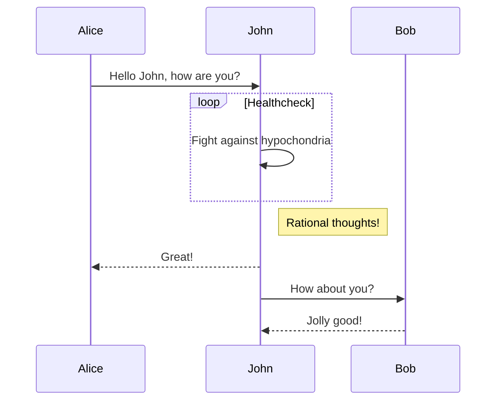

# Markdown 写作

本文提供了Markdown的基本撰写说明。

## 标题

你的内容标题应该从二级标题（ `##` ）开始

```markdown
# 一级标题
## 二级标题
### 三级标题
```

## 强调，斜体，删除线

我们只知道 **地球** 具有让人类生存的环境，还有 ~~火星~~ ，也许还有 *其它星球* 。

```markdown
我们只知道 **地球** 具有让人类生存的环境，还有 ~~火星~~ ，也许还有 *其它星球* 。
```

## 分隔符

```markdown
---
***
```

## 链接

你应该避免直接内嵌 HTML 代码。

```markdown
[link name](link url) 或者 <link url>
```

## 列表

- 多翻译引擎
  
    * 谷歌翻译
    * 微软翻译
    * 有道翻译
    * 百度翻译
    * 阿里翻译
    * DeepL 翻译

- 多语言互译

```markdown
- 多翻译引擎
  
    * 谷歌翻译
    * 微软翻译
    * 有道翻译
    * 百度翻译
    * 阿里翻译
    * DeepL 翻译

- 多语言互译
```

## 代码

使用单引号 `code` 来表示行内代码，使用三引号来表示代码块。

```java
code
```

并且对于代码块，你应该**写上对应的语言**。

## 图片

你应该避免内嵌 HTML 来插入图片。

```java

```

## 注释

下面是一段注释
> 这里是一段注释 (`<blockquote></blockquote>`)
> 这是注释的第二行

```python
# 这里是注释里面的代码段
print("hello")
```

> 注释
>> 注释嵌套
>> 注释嵌套

```markdown
下面是一段注释
> 这里是一段注释 (`<blockquote></blockquote>`)
> 这是注释的第二行

# 这里是注释里面的代码段
print("hello")

> 注释
>> 注释嵌套
>> 注释嵌套
```

## Emoji

暂不支持 `emoji` 语法，但是可以直接从 `emoji` 表情大全拷贝表情到文档，比如:
🍊 🍇 😀 😅 😇

> 访问<http://emojihomepage.com/>以获取更多emoji

## 上下标

H~2~O， y = x^2^

```markdown
H~2~O， y = x^2^
```

## 引用

我能干饭我自豪。[^干饭人]

[^干饭人]: 老子说道
这会在文章末尾进行注解

```markdown
我能干饭我自豪。[^干饭人]

[^干饭人]: 老子说道
这会在文章末尾进行注解
```

## 表格

| Header 1 | *Header2* |
| -------- | -------- |
| `Cell 1` | [Cell 2](http://example.com) link |
| Cell 3 | **Cell 4** |

```markdown
| Header 1 | *Header2* |
| -------- | -------- |
| `Cell 1` | [Cell 2](http://example.com) link |
| Cell 3 | **Cell 4** |
```

## 任务列表

- [x] 任务1
- [x] 任务2
- [ ] 任务3
- [ ] 任务4

```markdown
- [x] 任务1
- [x] 任务2
- [ ] 任务3
- [ ] 任务4
```

## 数学

文档支持 `LaTeX` ，关于 `LaTeX` ，你可以访问 [LaTeX公式手册](https://www.cnblogs.com/1024th/p/11623258.html) 来获取帮助。

## mermaid 支持

使用 mermaid 可以画很多类型的图表， 详细的语法和支持请看[官网](https://mermaid-js.github.io/)



```markdown
    ```mermaid
    sequenceDiagram
        Alice->>John: Hello John, how are you?
        loop Healthcheck
            John->>John: Fight against hypochondria
        end
        Note right of John: Rational thoughts!
        John-->>Alice: Great!
        John->>Bob: How about you?
        Bob-->>John: Jolly good!
    ```
```
